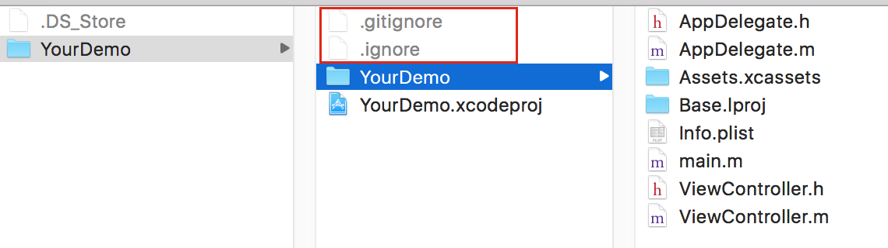
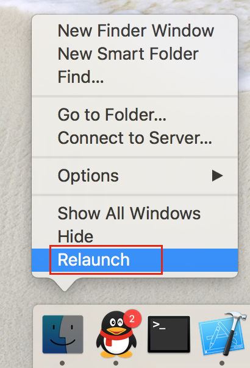

# ZZGitIgnoreContent
**OC, XCode使用Git应当忽略的文件**

```
cd IgnoreContent // 进入到IgnoreContent
ls -a // 显示隐藏文件 .gitignore	.ignore
cp .gitignore [你的工程所在目录] // 把.gitignore文件拷贝到你的工程文件所在目录下
cp .ignore [你的工程所在目录] // 把.ignore文件拷贝到你的工程文件所在目录下
```

**形如：**



****************
MAC OS 显示隐藏文件方法：
可以通过命令方式：ls -a ，其中-a是显示隐藏文件的意思，也可以让系统不隐藏(实验环境：OS X EI Capitan 10.11.2)：  
1. 点击Finder，打开Finder  
2. 打开Terminal  
3. 输入以下命令：
   `defaults write com.apple.Finder AppleShowAllFiles YES`  
4. 退出Terminal  
5. 重启Finder: 按住option键并右键点击Finder，选择重启Finder 

此时可以在Finder 中查看隐藏文件


